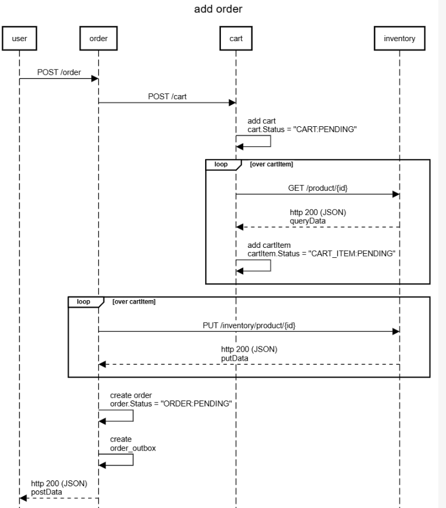
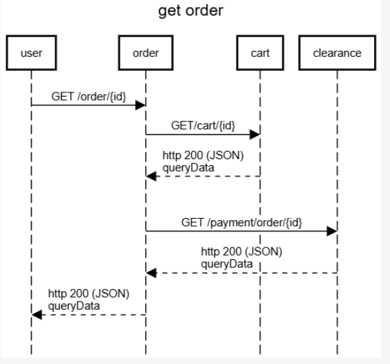

## go-order

   This is workload for POC purpose such as load stress test, gitaction, etc.

   The main purpose is create an order with its carts associated.

   To local test you should use the work space:
   
   Create a work space (root)
   
    go work init ./cmd ../go-core

   Add module (inside /cmd)
   
    go work use ..
    
## Sequence Diagram

    
    title add order

    participant user
    participant order
    participant cart
    participant inventory

    user->order:POST /order
    order->cart:POST /cart
    cart->cart:add cart\ncart.Status = "CART:PENDING"
        loop over cartItem
        cart->inventory:GET /product/{id}
        cart<--inventory:http 200 (JSON)\nqueryData
        cart->cart:add cartItem\ncartItem.Status = "CART_ITEM:PENDING"
        end
    postData
    queryData
    loop over cartItem
    order->inventory:PUT /inventory/product/{id}
    order<--inventory:http 200 (JSON)\nputData
    end
    order->order:create order\norder.Status = "ORDER:PENDING"
    order->order:create \norder_outbox
    user<--order:http 200 (JSON)\npostData

    
    title checkout order

    participant user
    participant order
    participant cart
    participant inventory
    participant clearance
    participant kafka
    participant worker-event
    
    entryspacing 0.7
    user->order:POST /order/checkout
    order->cart:GET/cart/{id}
    order<--cart:http 200 (JSON)\npostData

    loop over all cart_item
    order->order:cartItem.status == "CART_ITEM:SOLD"
    order->inventory:PUT /inventory/product/{id}
    order<--inventory:http 200 (JSON)\nputData
    order->cart:PUT /cartItem/{id}
    order<--cart:http 200 (JSON)\nputData
    end
    order->cart:PUT /cart/{id}\ncart.status = "CART:SOLD"
    order<--cart:http 200 (JSON)\nputData
    order->order:update order\norder.status = "ORDER:SOLD"
 
    alt addPayment
 
        order->clearance:POST /clearance
    clearance->order:GET /order/{id}
    clearance<--order:http 200 (JSON)\ngetData
    clearance->clearance:create Payment\nclearance.status = "CLEARANCE:SOLD"
    clearance->kafka:EVENT topic.clearance
        order<--inventory:http 200 (JSON)\npostData
    end
    user<--order:http 200 (JSON)\npostData
    kafka<-worker-event:EVENT topic.clearance
  

    title get order

    participant user
    participant order
    participant cart
    participant clearance
    
    entryspacing 0.7
        user->order:GET /order/{id}
        order->cart:GET/cart/{id}
        order<--cart:http 200 (JSON)\nqueryData
        postData
        queryData
    space
        order->clearance:GET /payment/order/{id}
        order<--clearance:http 200 (JSON)\nqueryData
        user<--order:http 200 (JSON)\nqueryData

## Enviroment variables

To run in local machine for local tests creat a .env in /cmd folder

    VERSION=1.0
    ACCOUNT=aws:localhost
    APP_NAME=go-order.localhost
    PORT=7004
    ENV=dev

    DB_HOST= 127.0.0.1 
    DB_PORT=5432
    DB_NAME=postgres
    DB_MAX_CONNECTION=30
    CTX_TIMEOUT=10

    LOG_LEVEL=info #debug, info, error, warning
    OTEL_EXPORTER_OTLP_ENDPOINT = localhost:4317

    OTEL_METRICS=true
    OTEL_STDOUT_TRACER=false
    OTEL_TRACES=true

    OTEL_LOGS=true
    OTEL_STDOUT_LOG_GROUP=true
    LOG_GROUP=/mnt/c/Eliezer/log/go-order.log

    NAME_SERVICE_00=go-cart
    URL_SERVICE_00=http://localhost:7001
    HOST_SERVICE_00=go-cart
    CLIENT_HTTP_TIMEOUT_00=5

    NAME_SERVICE_01=go-inventory
    URL_SERVICE_01=http://localhost:7000
    HOST_SERVICE_01=go-inventory
    CLIENT_HTTP_TIMEOUT_01=5

    NAME_SERVICE_02=go-clearance
    URL_SERVICE_02=http://localhost:7003
    HOST_SERVICE_02=go-clearance
    CLIENT_HTTP_TIMEOUT_02=5
   
## Endpoints

curl --location 'http://localhost:7004/health'

curl --location 'http://localhost:7004/live'

curl --location 'http://localhost:7004/header'

curl --location 'http://localhost:7004/context'

curl --location 'http://localhost:7004/info'

curl --location 'http://localhost:7004/metrics'

curl --location 'http://localhost:7004/order/96'

curl --location 'http://localhost:7004/order' \
    --header 'Content-Type: application/json' \
    --data '{
        "user_id": "eliezer",
        "currency": "BRL",
        "address": "st. a",
        "cart": {
                    "user_id": "eliezer",
                    "cart_item": [ 
                        {   "product": {
                                "sku": "mobile-100"
                            },
                            "currency": "BRL",
                            "quantity": 1,
                            "price": 10
                        },
                        {
                            "product": {
                                "sku": "mobile-101"
                            },
                            "currency": "BRL",
                            "quantity": 2,
                            "price": 5
                        }
                    ]
            }
    }'

curl --location 'http://localhost:7004/checkout' \
    --header 'Content-Type: application/json' \
    --data '{
        "id": 94,
        "payment": [
            {
                "type": "CASH",
                "currency": "BRL",
                "amount": 1000
            }
        ]
    }'

## Monitoring

Logs: JSON structured logging via zerolog

Metrics: Available through endpoint /metrics via otel/sdk/metric

Trace: The x-request-id is extract from header and is ingest into context, in order the x-request-id do not exist a new one is generated (uuid)

Errors: Structured error handling with custom error types

## Security

Security Headers: Is implement via go-core midleware

## Tables

    CREATE TABLE public.order (
        id 				BIGSERIAL		NOT NULL,
        transaction_id	VARCHAR(100) 	NULL,
        fk_cart_id 		BIGSERIAL 		NOT NULL,
        user_id 		VARCHAR(100) 	NOT NULL,    
        status 			VARCHAR(100) 	NOT NULL,
        currency 		VARCHAR(100) 	NOT NULL,
        amount 			DECIMAL(10,2) 	NOT null DEFAULT 0,
        address			VARCHAR(200) 	NULL,
        created_at		timestamptz 	NOT NULL,
        updated_at		timestamptz 	NULL,
    CONSTRAINT order_pkey PRIMARY KEY (id)
    );

    ALTER TABLE public.order ADD constraint order_fk_cart_id_fkey
    FOREIGN KEY (fk_cart_id) REFERENCES public.cart(id);

    CREATE TYPE order_outbox_event_type AS ENUM (
            'order_created',
            'order_checkout'
    );
        
    CREATE TABLE order_outbox (
            event_id uuid NOT NULL,
            event_type order_outbox_event_type NOT NULL,
            event_date timestamptz NOT NULL DEFAULT now(),
            transaction_id VARCHAR(100) NULL,
            event_metadata json NOT NULL DEFAULT '{}'::json,
            event_data json NOT NULL DEFAULT '{}'::json,
            event_error json NULL DEFAULT '{}'::json,
            CONSTRAINT order_outbox_pkey PRIMARY KEY (event_id)
    );

    CREATE INDEX idx1_order_outbox ON order_outbox USING btree (event_id, event_date);